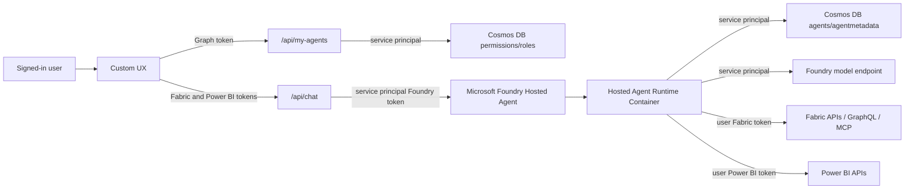

# Fabric Agent Tool Solution

This repository contains a complete Microsoft Fabric agent solution built around three cooperating pieces:

- `agent_management`: a management application for creating and deploying Fabric-aware agents to Microsoft Foundry Hosted Agents.
- `agent_management/hosted_agent_runtime`: the reusable container runtime that a deployed Foundry Hosted Agent runs.
- `custom_ux`: an end-user chat application that lists only the agents the signed-in user is allowed to access and streams responses from Foundry.

The solution separates Foundry and Fabric authorization intentionally. The service principal calls Microsoft Foundry, Azure AI, Cosmos DB, and the LLM endpoint. The signed-in user's tokens are passed to the hosted runtime only for Fabric and Power BI operations, so Fabric data access still follows the user's permissions.

## High-Level Architecture



## Applications

### Agent Management

The agent management app is the authoring and deployment surface. It lets an authenticated user create projects, bind them to Fabric data sources, generate prompts, and deploy the resulting configuration as a Foundry Hosted Agent.

Key responsibilities:

- Discover Fabric data sources the user can access.
- Create standalone agents or orchestrator agents.
- Generate system prompts with a Foundry model.
- Store project metadata in Azure Cosmos DB.
- Deploy Foundry Hosted Agents using the reusable hosted runtime image.

Important files:

- [agent_management/backend/server.py](agent_management/backend/server.py)
- [agent_management/backend/hosted_agent_builder.py](agent_management/backend/hosted_agent_builder.py)
- [agent_management/backend/project_store.py](agent_management/backend/project_store.py)
- [agent_management/frontend/src/App.tsx](agent_management/frontend/src/App.tsx)
- [agent_management/README.md](agent_management/README.md)

### Hosted Agent Runtime

The hosted runtime is the container image registered with Foundry. It does not contain a generated copy of each agent. Instead, the runtime receives a project ID through environment variables, loads the current project definition from Cosmos DB at startup/runtime, builds an Agent Framework agent, and exposes the OpenAI Responses-compatible protocol endpoints that Foundry expects.

The runtime supports:

- Standalone Fabric agents.
- Orchestrator-only agents that invoke other deployed hosted agents.
- Agents with semantic model, GraphQL, SQL endpoint, Fabric Data Agent, and Fabric MCP tools.
- Streaming responses through server-sent events.
- User-token-based Fabric and Power BI tool execution.
- Service-principal-based Foundry, LLM, and Cosmos access.

Important file:

- [agent_management/hosted_agent_runtime/app.py](agent_management/hosted_agent_runtime/app.py)

### Custom UX

The custom UX is the end-user chat surface. It signs users in with MSAL, loads the agents they are allowed to see from Cosmos-backed role bindings, and streams chat responses from Foundry through its backend.

Key responsibilities:

- Authenticate the signed-in user.
- Request a Microsoft Graph token so the backend can identify the user and group membership.
- Request Fabric and Power BI tokens for data-plane calls.
- Call `/api/my-agents` to load only role-authorized agents.
- Call `/api/chat` to stream a selected hosted agent response.
- Render incremental text deltas in the chat panel.

Important files:

- [custom_ux/backend/server.py](custom_ux/backend/server.py)
- [custom_ux/backend/memory.py](custom_ux/backend/memory.py)
- [custom_ux/frontend/src/App.tsx](custom_ux/frontend/src/App.tsx)
- [custom_ux/frontend/src/components/Sidebar.tsx](custom_ux/frontend/src/components/Sidebar.tsx)
- [custom_ux/frontend/src/components/ChatPanel.tsx](custom_ux/frontend/src/components/ChatPanel.tsx)
- [custom_ux/frontend/src/components/ChatInput.tsx](custom_ux/frontend/src/components/ChatInput.tsx)

## Authorization Model

The solution uses two different authorization contexts.

### Service Principal

The service principal is configured with:

```text
AZURE_TENANT_ID
APP_CLIENT_ID
APP_CLIENT_SECRET
```

It is used for:

- Azure Cosmos DB project metadata.
- Azure Cosmos DB permissions and role bindings.
- Microsoft Foundry API calls.
- Foundry-hosted LLM calls through `FoundryChatClient`.
- Agent-to-agent Foundry calls from orchestrator-only agents.
- Mem0 calls to Foundry-backed embedding and chat deployments.

The hosted runtime uses `ClientSecretCredential` when those values are present and falls back to `DefaultAzureCredential` otherwise.

### Signed-In User

The signed-in user's delegated tokens are used for data access:

- Microsoft Graph token: identifies the user and group membership for role filtering.
- Fabric token: authorizes Fabric API, GraphQL, SQL endpoint, Fabric Data Agent, and Fabric MCP calls.
- Power BI token: authorizes semantic model metadata and DAX query calls where needed.

The Foundry playground does not supply the user's Fabric token. Fabric-backed agents therefore require the custom UX or another client that forwards the user's Fabric token.

## Cosmos DB Data Model

The solution uses two logical Cosmos areas.

### Agent Projects

Project metadata is stored in:

```text
Database: agents
Container: agentmetadata
```

Each project document describes the deployment mode, prompt configuration, model configuration, data source bindings, and deployed agent metadata.

The hosted runtime loads the project by ID using:

```text
MAF_MGMT_PROJECT_ID
MAF_MGMT_COSMOS_ENDPOINT
MAF_MGMT_COSMOS_DATABASE
MAF_MGMT_COSMOS_CONTAINER
```

Fallback `AGENT_MGMT_*` environment variable names are also supported by the runtime.

### Roles and Agent Bindings

Permissions are stored in:

```text
Database: permissions
Container: roles
```

The custom UX uses these documents to decide which agents the signed-in user can see.

Role documents use:

```json
{
  "type": "role",
  "members": [
    {
      "object_id": "<user-or-group-object-id>"
    }
  ]
}
```

Agent role binding documents use:

```json
{
  "type": "agent_role_binding",
  "agent_name": "<foundry-agent-name>",
  "project_display_name": "<display-name>",
  "role_ids": ["<role-id>"]
}
```

The custom UX no longer uses hardcoded `FOUNDRY_*_AGENT` environment variables for agent visibility. Cosmos role bindings are the source of truth.

For first-time setup, `AGENT_MGMT_BOOTSTRAP_ADMIN_OBJECT_IDS` can contain a comma-separated list of Entra user or group object IDs. When a matching user signs in, the backend treats them as an Admin and creates or updates the Cosmos `Admin` role with that user or group as a member.

## Deployment Modes

### Standalone Agent

A standalone project creates one hosted agent. The runtime builds a single Agent Framework agent with tools appropriate for the configured Fabric source.

Supported source types include:

- `semantic_model`
- `graphql`
- `sql_endpoint`
- `data_agent`
- `fabric_mcp`

### Orchestrator With Subagents

An orchestrator project can route across subagents defined in the project configuration. The runtime builds the appropriate tool set for the configured data sources.

### Orchestrator Only

An orchestrator-only project delegates to existing deployed hosted agents. The runtime creates one tool per external agent and invokes those agents through Foundry using a service-principal Azure AI token. User Fabric and Power BI tokens are forwarded in the request body so downstream agents can still call Fabric as the user.

## Streaming Flow

Streaming is implemented across all three layers.

1. The custom UX frontend calls its backend with `stream: true` and reads `resp.body.getReader()`.
2. The custom UX backend calls Foundry with `Accept: text/event-stream` and proxies the SSE stream.
3. The hosted runtime returns `StreamingResponse` from `/responses` when the request body has `stream: true`.
4. The hosted runtime emits OpenAI Responses-style SSE events:

```text
event: response.created
event: response.output_text.delta
event: response.completed
data: [DONE]
```

The runtime uses the Agent Framework streaming API where available:

```python
if hasattr(agent, "run_stream"):
    stream = agent.run_stream(message, thread=thread)
elif thread is not None:
    stream = agent.run(message, stream=True, session=thread)
else:
    stream = agent.run(message, stream=True)
```

This is important because the installed Agent Framework package may expose streaming as `agent.run(..., stream=True)` rather than `agent.run_stream(...)`.

## Memory

The custom UX memory layer uses Mem0 with Foundry-backed chat and embedding deployments.

Current behavior:

- Uses `FOUNDRY_PROJECT_ENDPOINT` to derive the Azure AI endpoint.
- Uses service-principal authentication through an Azure AD token provider.
- Does not require `AOAI_ENDPOINT` or `AOAI_KEY`.

Important file:

- [custom_ux/backend/memory.py](custom_ux/backend/memory.py)

## Important Environment Variables

### Shared Azure Identity

```text
AZURE_TENANT_ID
APP_CLIENT_ID
APP_CLIENT_SECRET
```

### Foundry

```text
FOUNDRY_PROJECT_ENDPOINT
MAF_FOUNDRY_PROJECT_ENDPOINT
FOUNDRY_API_VERSION
FOUNDRY_FEATURES
FOUNDRY_TOKEN_SCOPE
AZURE_OPENAI_DEPLOYMENT_NAME
```

`FOUNDRY_TOKEN_SCOPE` defaults to:

```text
https://ai.azure.com/.default
```

### Agent Project Cosmos DB

```text
AGENT_MGMT_COSMOS_ENDPOINT
AGENT_MGMT_COSMOS_DATABASE
AGENT_MGMT_COSMOS_CONTAINER
MAF_MGMT_COSMOS_ENDPOINT
MAF_MGMT_COSMOS_DATABASE
MAF_MGMT_COSMOS_CONTAINER
MAF_MGMT_PROJECT_ID
```

### Permissions Cosmos DB

```text
AGENT_MGMT_PERMISSIONS_DATABASE
AGENT_MGMT_PERMISSIONS_CONTAINER
AGENT_MGMT_PERMISSIONS_PARTITION_KEY
AGENT_MGMT_BOOTSTRAP_ADMIN_OBJECT_IDS
```

### Fabric and Power BI

```text
FABRIC_CORE_MCP_ENDPOINT
FABRIC_GRAPHQL_QUERY_URL_TEMPLATE
FABRIC_MCP_SQL_TOOL_NAME
FABRIC_MCP_DATA_AGENT_TOOL_NAME
```

The Fabric and Power BI bearer tokens themselves are supplied dynamically by the custom UX, not as static server environment variables.

## Local Development

### Agent Management

```powershell
Set-Location agent_management
Copy-Item env.TEMPLATE .env
Copy-Item frontend\env.TEMPLATE frontend\.env
..\.venv\Scripts\python.exe -m pip install -r requirements.txt
.\start-dev.ps1
```

Open:

```text
http://localhost:5173
```

### Custom UX

```powershell
Set-Location custom_ux
Copy-Item env.TEMPLATE .env
..\.venv\Scripts\python.exe -m pip install -r requirements.txt
Set-Location frontend
npm install
npm run build
```

Run the backend from `custom_ux` with the configured FastAPI command used by the environment.

## Hosted Runtime Build and Push

Build the hosted runtime from its own directory:

```powershell
$env:PYTHONIOENCODING = "utf-8"
Push-Location agent_management\hosted_agent_runtime
az acr build `
  --registry adventureworksacr `
  --image hosted-agent-runtime:latest `
  --image hosted-agent-runtime:v8 `
  . `
  --no-logs
```

The most recent validated image from this solution work is:

```text
adventureworksacr.azurecr.io/hosted-agent-runtime:v8
sha256:2cefe9f3da7272e9c08c6672da873e157c7a5368effaaf48a3b75b76e66f4e79
```

Use the versioned tag when updating Foundry Hosted Agents. Foundry can cache `latest`, so a versioned tag is the safer cache-busting deployment target.

## Validation Commands

Validate Python syntax for the hosted runtime:

```powershell
Push-Location agent_management\hosted_agent_runtime
..\..\.venv\Scripts\python.exe -m py_compile app.py
```

Validate the custom UX frontend build:

```powershell
Push-Location custom_ux\frontend
npm run build
```

Verify the newest ACR manifest:

```powershell
az acr manifest list-metadata `
  --registry adventureworksacr `
  --name hosted-agent-runtime `
  --top 1 `
  --orderby time_desc `
  --query "[0].{digest:digest, lastUpdate:lastUpdateTime}" `
  -o table
```

## Troubleshooting

### The Foundry Playground Returns a Fabric Token Error

The playground does not provide the signed-in user's Fabric bearer token to the hosted runtime. Use the custom UX, or another caller that forwards `fabric_token` and optionally `powerbi_token` in the request.

### Agents Appear in the Custom UX for the Wrong Users

Check the `permissions.roles` Cosmos container. The custom UX reads role documents and `agent_role_binding` documents from Cosmos. Hardcoded Foundry agent environment variables are not used for visibility.

### Agent-to-Agent Calls Fail with Authorization Errors

Agent-to-agent Foundry calls must use a service-principal Azure AI token in the `Authorization` header. The user's Fabric token should be forwarded in the body for Fabric operations only.

### Responses Appear All at Once Instead of Streaming

Check each streaming layer:

- The frontend must read `resp.body.getReader()`.
- The custom UX backend must request and proxy `text/event-stream`.
- The hosted runtime request body must include `stream: true`.
- The hosted runtime must call either `agent.run_stream(...)` or `agent.run(..., stream=True)`.
- The deployed Foundry Hosted Agent must use an image tag that includes the streaming fix, such as `v6`.

### `session_not_ready` from Connected Agents

The orchestrator-only runtime retries connected agent calls when Foundry reports `session_not_ready`. If it persists, verify the target hosted agent image, endpoint, and deployment state.

### `latest` Image Does Not Pick Up Changes

Use versioned image tags such as `v6` when updating Foundry Hosted Agents. This avoids stale image caching behavior.

## Operational Notes

- Keep the service principal's Cosmos DB data-plane permissions current for both project metadata and permissions containers.
- Keep Fabric and Power BI delegated scopes configured in the custom UX app registration.
- Prefer versioned hosted runtime image tags for Foundry deployments.
- Rebuild the custom UX frontend before serving production static assets from FastAPI.
- Re-run `py_compile` after changing the hosted runtime because deployment feedback from Foundry can be slower than local syntax validation.